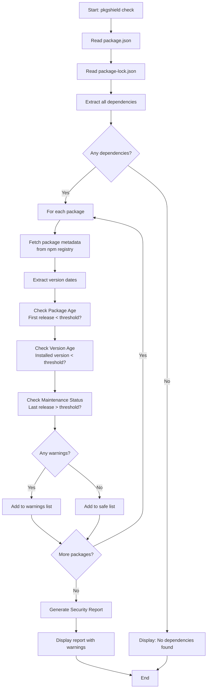

# Pkgshield Roadmap

- **Version:** 0.1.1
- **Owner:** Maxi Ferreira
- **Last Updated:** November 12, 2025

---

## What is Pkgshield?

**Pkgshield** is a CLI tool designed to protect your Node.js projects against supply chain attacks, specifically targeting the threat of "slopsquatting" (also known as hallucinated dependencies). Slopsquatting occurs when malicious actors create packages with names that are similar to popular packages, hoping developers will accidentally install them due to typos or AI-generated code suggestions.

## How It Works

Pkgshield analyzes your project's dependencies by examining package metadata from the npm registry and applying time-based security heuristics. Here's a high-level overview of the process:



### Example Input

Given a `package.json` file like this:

```json
{
  "name": "my-project",
  "version": "1.0.0",
  "dependencies": {
    "express": "^4.18.2",
    "lodash": "^4.17.21",
    "suspicious-pkg": "^1.0.0"
  },
  "devDependencies": {
    "typescript": "^5.0.0"
  }
}
```

### Example Output

Running `pkgshield check` would produce output like:

```bash
$ pkgshield check

Checking 4 packages...

=== SECURITY CHECK REPORT ===

⚠️  Found 1 package(s) with warnings:

📦 suspicious-pkg@1.0.0
   First release: 2025-01-10
   Installed version date: 2025-01-11
   Latest release: 2025-01-11
   ⚠️  Package is too new (5 days old, threshold: 30 days)
   ⚠️  Installed version is too new (1 days old, threshold: 2 days)

✅ 3 package(s) passed all checks

=== END REPORT ===
```

### Example with Custom Thresholds

You can customize the thresholds using command-line flags:

```bash
$ pkgshield check --package-age 60 --version-age 7 --unmaintained 730

Checking 4 packages...

=== SECURITY CHECK REPORT ===

⚠️  Found 1 package(s) with warnings:

📦 old-package@2.0.0
   First release: 2020-05-15
   Installed version date: 2023-12-08
   Latest release: 2023-12-08
   ⚠️  Package may be unmaintained (800 days since last release, threshold: 730 days)

✅ 3 package(s) passed all checks

=== END REPORT ===
```

## Current State (v0.1.0)

Pkgshield currently provides a foundational security scanning capability:

### Core Features

- **Package Age Detection**: Identifies packages that are too new (default: < 30 days old), which may not have been battle-tested
- **Version Age Detection**: Flags recently published versions (default: < 2 days old) that could contain malicious code
- **Unmaintained Package Detection**: Warns about packages that haven't been updated in a while (default: > 365 days), which may have unpatched vulnerabilities

### Technical Implementation

- Built with [oclif](https://oclif.io/) framework for CLI development
- Reads `package.json` and `package-lock.json` files
- Fetches package metadata from the npm registry API
- Configurable thresholds via command-line flags
- Simple, human-readable report output

### Current Limitations

- Only supports npm (no yarn, pnpm, or other package managers)
- Basic checks based on time-based heuristics
- No integration with vulnerability databases
- No CI/CD integration
- Limited output formats (text only)
- No caching mechanism (always fetches from registry)
- No configuration file support

## Vision for the Future

### Short-term Goals (v0.2.0 - v0.3.0)

#### Enhanced Detection Capabilities

- **Typosquatting Detection**: Identify packages with names suspiciously similar to popular packages
- **Author Reputation Checks**: Verify package authors against known maintainers of popular packages
- **Download Statistics Analysis**: Flag packages with unusual download patterns
- **GitHub Repository Verification**: Check if packages have legitimate GitHub repositories

#### Developer Experience Improvements

- **Configuration File Support**: Add `.pkgshieldrc` or `pkgshield.config.json` for project-level settings
- **Multiple Output Formats**: Support JSON, SARIF, and other formats for CI/CD integration
- **Exit Codes**: Proper exit codes for CI/CD pipelines (non-zero on warnings/errors)
- **Better Error Handling**: More graceful handling of network errors and missing packages

#### Performance Optimizations

- **Caching Layer**: Cache npm registry responses to reduce API calls
- **Parallel Processing**: Check multiple packages concurrently
- **Incremental Checks**: Only check packages that have changed since last run

### Medium-term Goals (v0.4.0 - v0.6.0)

#### Multi-Package Manager Support

- **Yarn Support**: Read `yarn.lock` files
- **pnpm Support**: Read `pnpm-lock.yaml` files
- **Workspace Support**: Handle monorepos and workspace configurations

#### Advanced Security Features

- **Vulnerability Database Integration**: Cross-reference packages with known CVE databases
- **License Compliance Checking**: Identify packages with problematic licenses
- **Dependency Graph Analysis**: Analyze transitive dependencies for security issues
- **Historical Analysis**: Track package changes over time to detect suspicious patterns

#### CI/CD Integration

- **GitHub Actions**: Official GitHub Action for easy CI integration
- **GitLab CI**: Support for GitLab CI/CD pipelines
- **Jenkins Plugin**: Optional Jenkins plugin
- **Pre-commit Hooks**: Git hooks to check before commits

#### Reporting Enhancements

- **HTML Reports**: Generate detailed HTML reports with visualizations
- **Dashboard**: Optional web dashboard for tracking security over time
- **Email/Slack Notifications**: Alert teams when issues are detected
- **Trend Analysis**: Track security posture improvements over time

### Long-term Goals (v0.7.0+)

#### Enterprise Features

- **Policy Engine**: Define organizational security policies
- **Whitelist/Blacklist Management**: Manage approved and blocked packages
- **Audit Logging**: Track all security checks and decisions
- **Team Collaboration**: Share security findings across teams

#### Advanced Analytics

- **Risk Scoring**: Calculate risk scores for packages based on multiple factors
- **Machine Learning**: Use ML to detect suspicious patterns
- **Predictive Analysis**: Predict which packages might become problematic

#### Ecosystem Integration

- **IDE Plugins**: VS Code, IntelliJ, and other IDE extensions
- **Package Registry Integration**: Work with private npm registries
- **Security Advisory Integration**: Integrate with npm security advisories and GitHub Security Advisories

#### Community & Open Source

- **Plugin System**: Allow community to extend functionality
- **Rule Marketplace**: Share custom detection rules
- **Community Database**: Crowdsourced package reputation data

## Contributing

We welcome contributions! Areas where help is especially appreciated:

- Additional package manager support
- New detection algorithms
- Performance improvements
- Documentation and examples
- Bug fixes and edge case handling

See our [Contributing Guide](CONTRIBUTING.md) (coming soon) for more details.

## Feedback

Have ideas or suggestions? Please open an issue on [GitHub](https://github.com/Charca/pkgshield/issues) or reach out to the maintainers.
